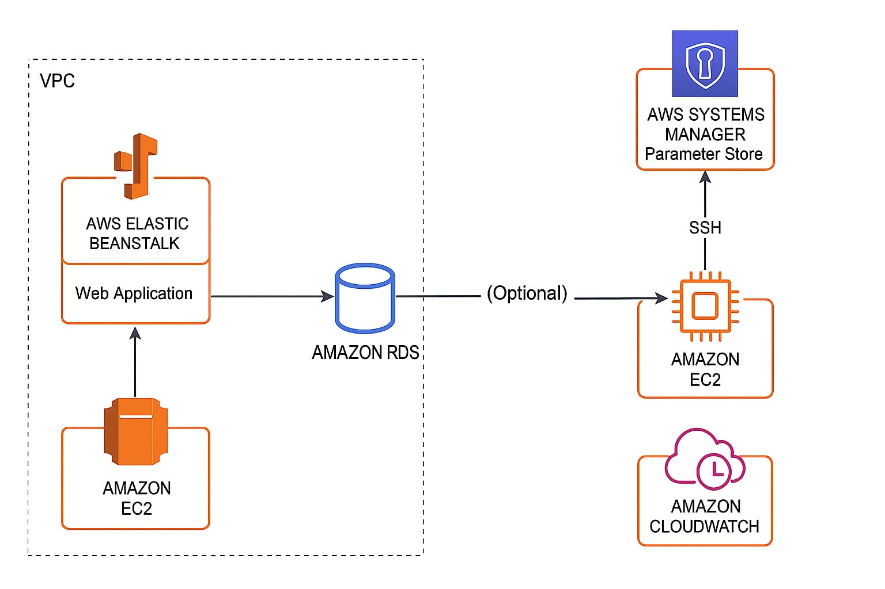
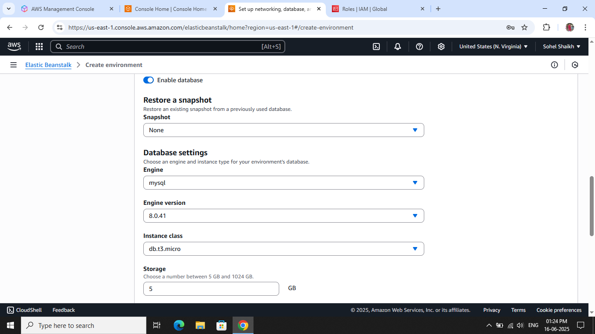
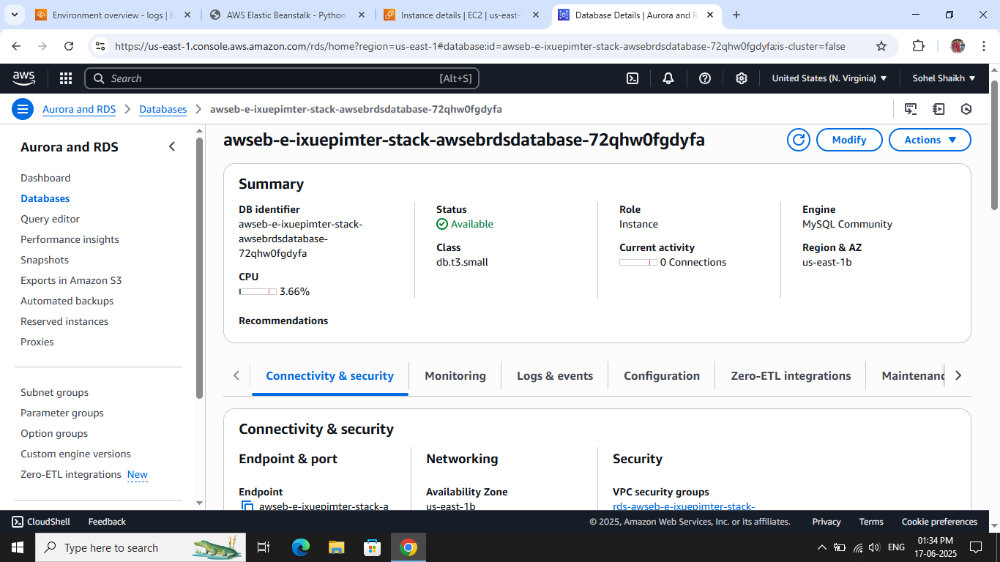
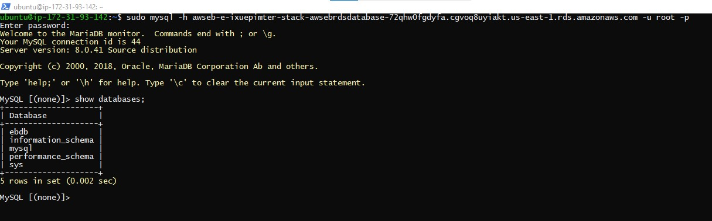
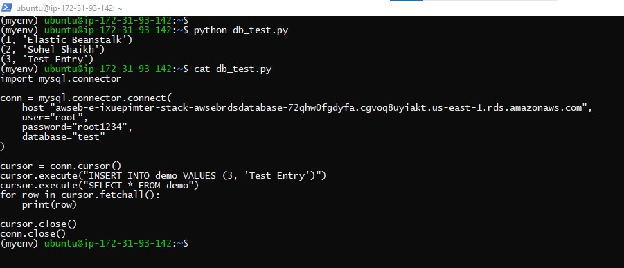
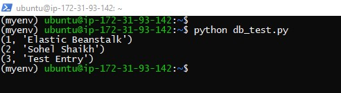
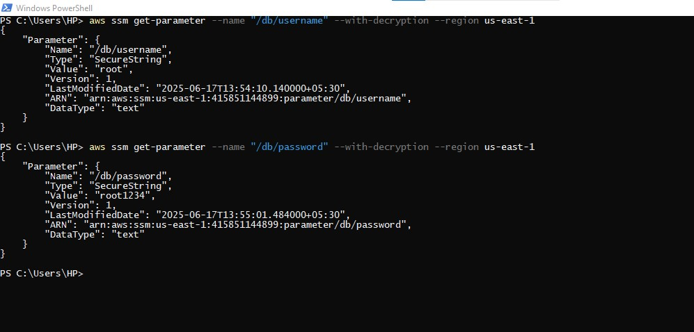
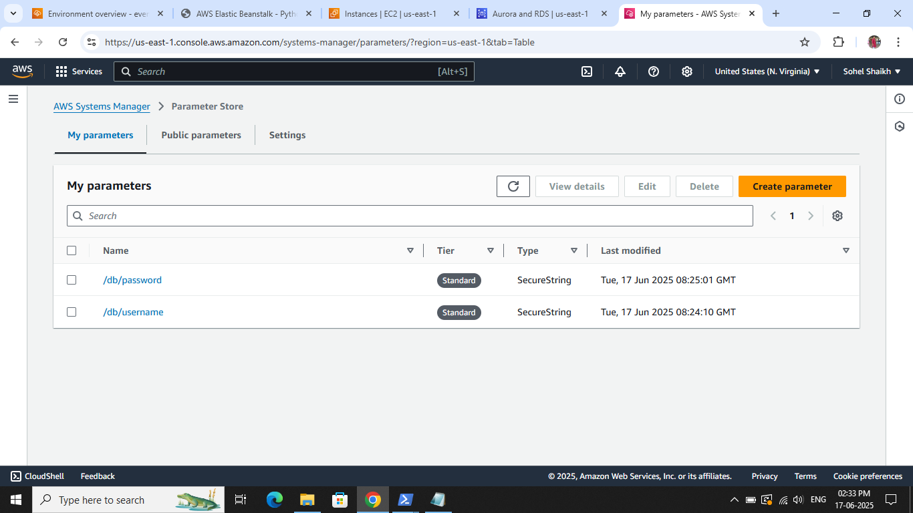
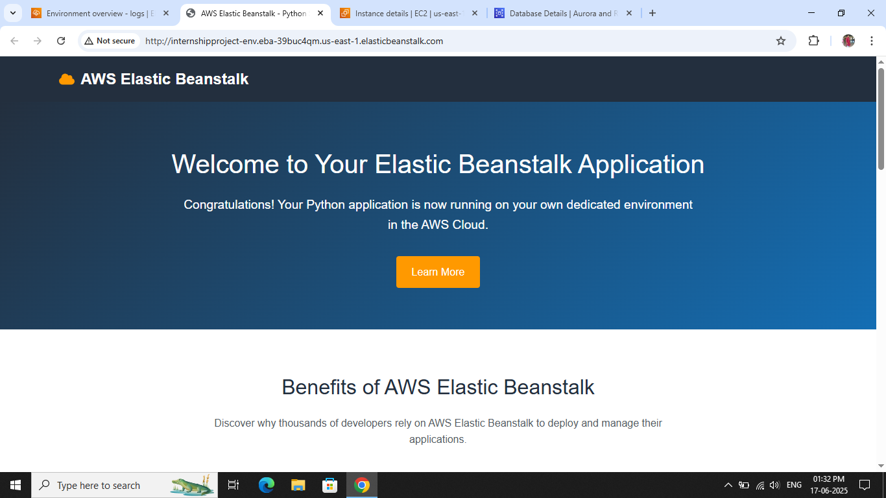
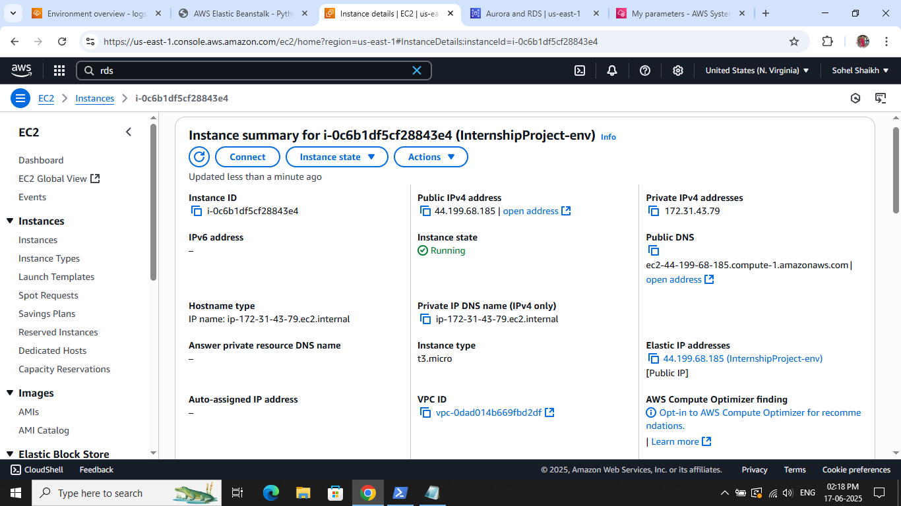

# 🛠️ Project 1: Using AWS Elastic Beanstalk to Set Up RDS and Access It from an EC2 Instance

## 🎯 Objective
Deploy a sample application using **AWS Elastic Beanstalk**, provision an **Amazon RDS (MySQL)** database within the same VPC, and access it securely from a **separate EC2 instance**.

---

## 🧰 Technologies & Tools
- AWS Elastic Beanstalk
- Amazon RDS (MySQL)
- Amazon EC2
- VPC/Subnet/Security Groups
- AWS Systems Manager (SSM) Parameter Store
- Python + mysql-connector

---

## 🏗️ Architecture Diagram



---

## 🚀 Step-by-Step Setup

### 1. Elastic Beanstalk Environment Setup
- Created an **Elastic Beanstalk environment** with a sample Python web app.
- During environment creation:
  - Selected `MySQL` as the RDS engine.
  - Instance Class: `db.t3.micro`
  - Storage: `5 GB`
  - Enabled database creation inside **same VPC**.
- ✅ Successfully launched the Beanstalk app.

📸 

---

### 2. RDS Configuration
- RDS Instance created by Elastic Beanstalk:
  - Engine: MySQL 8.0.41
  - Class: db.t3.small
  - Region & AZ: us-east-1b
- Verified database status as `Available`.
- ✅ Ensured security group allows access only from Beanstalk and EC2.

📸 

---

### 3. EC2 Instance Setup
- Launched an EC2 instance in same VPC.
- SSH’d into instance and installed MySQL client:
  ```bash
  sudo apt update
  sudo apt install mysql-client
  ```
- Connected to RDS using:
  ```bash
  mysql -h <RDS-ENDPOINT> -u root -p
  ```

📸 

---

## 4. 🛢️ Database Connection & Testing

- Created and connected to DB `test`
- Created table:
  ```sql
  CREATE TABLE demo (
    id INT AUTO_INCREMENT PRIMARY KEY,
    name VARCHAR(100)
  );
  ```
- Inserted data and fetched it using Python:

```python
import mysql.connector

conn = mysql.connector.connect(
    host="awseb-e-ixuepimter-stack-awsebrdsdatabase-72qhw0fgdyfa.cgvoq8uyiakt.us-east-1.rds.amazonaws.com",
    user="root",
    password="root1234",
    database="test"
)

cursor = conn.cursor()
cursor.execute("INSERT INTO demo VALUES (3, 'Test Entry')")
cursor.execute("SELECT * FROM demo")
for row in cursor.fetchall():
    print(row)

cursor.close()
conn.close()
```

📸 

📸 

---

## 🔐 Security Considerations

- Created custom security groups:
  - Allowed MySQL (port 3306) **only** from EC2 and Beanstalk
  - **No public access** to RDS instance
- Used **AWS SSM Parameter Store** to securely store DB credentials:

```bash
aws ssm put-parameter --name "/db/username" --value "root" --type "SecureString"
aws ssm put-parameter --name "/db/password" --value "root1234" --type "SecureString"
```

📸 

📸 

---

## 📸 Screenshots Summary

✅ Elastic Beanstalk Deployment Success  


✅ EC2 Instnce Created by Elastic Beanstalk  


---

## ✅ Conclusion

This project helped me gain hands-on experience with:
- Deploying applications using **Elastic Beanstalk**
- Managing RDS databases inside a **VPC**
- Secure access from **EC2**
- Using **SSM Parameter Store** for secrets

---

